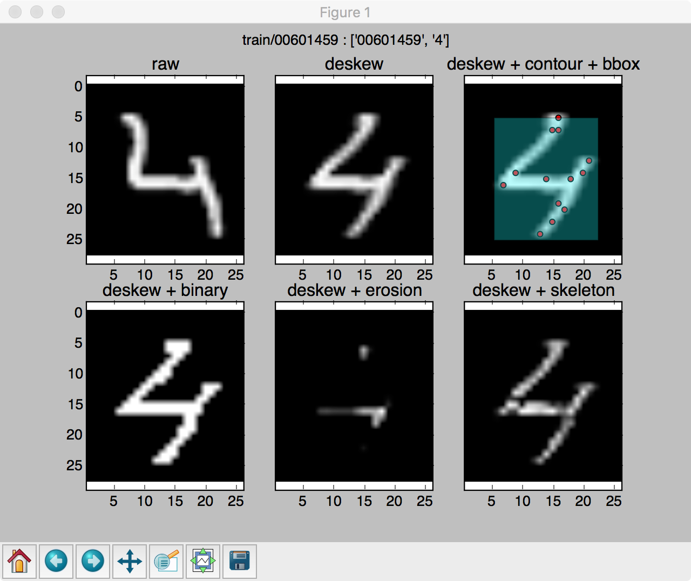

# Features
(Including the description and generating method of each feature)

*Preview of features (best training result = deskew)*

## Raw Data
Read data byte-by-byte then save as csv file

## Deskew (used in final training)
Remove skew from raw data to make pixels left-right-balance [using its second order moments](http://docs.opencv.org/3.1.0/dd/d3b/tutorial_py_svm_opencv.html#gsc.tab=0)

## Binary
Make deskew data binary to 0 or 255

## Erosion
Erode deskew data, keep white pixel only when surrounding ones are also white

## Skeleton
Erode deskew data intil it is 1-pixel thick

## Contour
Calculate contour points around boundary

## Bounding Box
Calculate bounding box with
* box center point
* box width
* box height
* box width/height ratio
